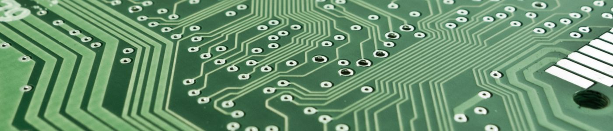
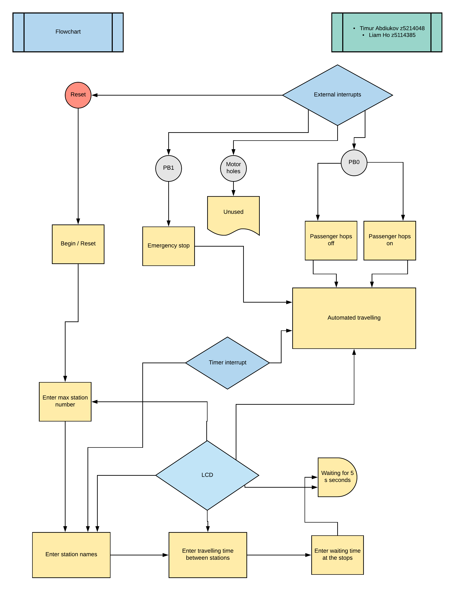

# AVR-monorail

*Microprocessors and Interfacing*

Major Project - Microprocessors and Interfacing (UNSW).

## Credits
* Liam Ho – z5114385
* Timur (Tim) Abdiukov – z5214048

## Flowchart

## Todo
(thanks [Markdown editor](https://jbt.github.io/markdown-editor/) )

- ~~subroutine to check if the go back space overflows (if it is more than 0, it will decrement)~~

- ~~add the hash key~~

- ~~B as Space~~

- ~~pressing too fast~~  *(made into a feature, check **input_wait** )*

- ~~display zero properly~~

- ~~Second character problem after 1 second~~ *(made into a feature, check timer subroutines)*

## Due time
DEMO
Oct 26 FRI
12:00-12:20 PM

SUBMISSION Midnight 28/10/2018 

PUBLICATION 06/12/2018 (onwards)
